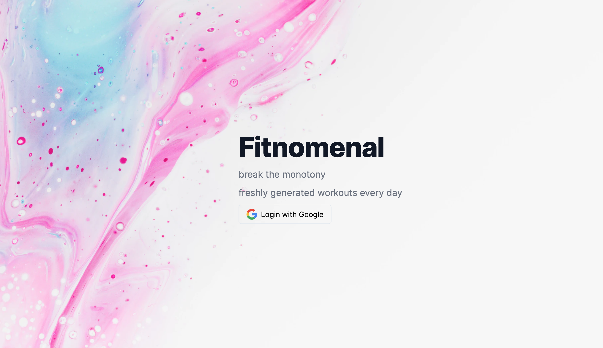
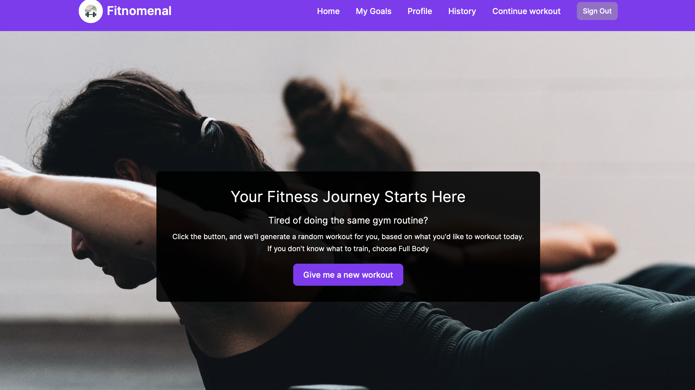

# Fitness Project

  


## Table of Contents

1. [Description](#description)
2. [Deployment Link](#deployment-link)
3. [Getting Started/Code Installation](#getting-startedcode-installation)
4. [Timeframe & Working Team](#timeframe--working-team)
5. [Technologies Used](#technologies-used)
6. [Brief](#brief)
7. [Planning](#planning)
   - 7.1 [Wireframes](#wireframes)
   - 7.2 [ERDs](#erds)
   - 7.3 [Project Management](#project-management)
8. [Build/Code Process](#buildcode-process)
   - 8.1 [Code Snippet 1: Fetching workout details](#code-snippet-1-fetching-workout-details)
   - 8.2 [Code Snippet 2: Rendering the workout goals page](#code-snippet-2-rendering-the-workout-goals-page)
   - 8.3 [Code Snippet 3: Saving completed workouts to the workout history database](#code-snippet-3-saving-completed-workouts-to-the-workout-history-database)
9. [Challenges](#challenges)
10. [Wins](#wins)
11. [Key Learnings/Takeaways](#key-learningstakeaways)
12. [Bugs](#bugs)
13. [Future Improvements](#future-improvements)

## Description

This fitness project is a web application designed to help users plan and track their daily workouts. It was completed during a one-week sprint as part of the coding bootcamp. The project focuses on providing users with a seamless experience for creating, managing, and completing their daily workout routines. The tech stack includes React for the front end, Node.js and Express for the back end, and MongoDB for the database.

## Deployment Link

The project is deployed and can be accessed at [Fitness App](https://fitnomenal-workouts.vercel.app). 

## Getting Started/Code Installation

To run the project locally, follow these steps:

1. Clone the repository: `git clone https://github.com/AishaA14/fitnomenal.git`
2. Navigate to the project directory: `cd fitnomenal`
3. Install dependencies: `npm install`
4. Start the development server: `npm start`
5. Open your browser and go to `http://localhost:3000/`

## Timeframe & Working Team

This project was completed in a group of three within a one-week timeframe.

## Technologies Used

- Front End: React
- Back End: Node.js, Express
- Database: MongoDB
- Development Tools: Git, VS Code, npm

## Brief

Create a fitness application that allows users to plan and track their daily workouts. The app should have user authentication, a user-friendly interface for adding and completing workouts, and a history feature to track past workouts.

## Planning

During the planning stage, I took the following steps:

1. **Wireframes**: Designed wireframes for the front end and UI to plan the app's structure, using excalidraw.


   
2. **ERDs**: Using Lusic Chart, we developed Entity Relationship Diagrams to define the relationships between different entities.


3. **Project Management**: Used Trello for project management, creating tickets, and allocating responsibilities in a sprint timeline.
   
My primary responsibility on the backend involved defining models for daily workouts and workout history. I established API endpoints to seamlessly connect the frontend with the backend, implementing functions for storing, retrieving, and deleting data from the database. Meanwhile, on the frontend, I curated a vibrant colour scheme and leveraged tools like Tailwind and Flowbite to style the web pages.


*Images of sketches, wireframes, and Trello board can be found in the [Planning](#planning) section below.*

## Build/Code Process


### Code Snippet 1: Fetching workout details

```jsx
const getDailyWorkout = async () => {
    //fetch workout details
    if (status === "authenticated") {
      try {
        const response = await fetch(`${DATABASE_CONNECTION}/daily-workout/get?userEmail=${userEmail}`)
        const result = await response.json()

        setDailyWorkout(result.exercises)
        
      } catch (error) {
        console.log('trouble fetching the daily workout', error)
        setDailyWorkout('no workout')
      }
    }
  }

```


### Code Snippet 2: Rendering the workout goals page

```jsx
// Define states
  const [userWorkoutGoal, setUserWorkoutGoal] = useState(0); // Workout goal from the database
  const [completedWorkouts, setCompletedWorkouts] = useState([]); // Array to store completed workouts
  const [currentWeight, setCurrentWeight] = useState(null); // Current weight in kg
  const [goalWeight, setGoalWeight] = useState(null); // Goal weight in kg

  const workoutsPercentage = (completedWorkouts.length/ userWorkoutGoal) * 100;
  const weightDifference = Math.abs(goalWeight - currentWeight);
  const weightChangeDirection = goalWeight > currentWeight ? "gain" : "lose";
  let weightProgress = 0;
  
  if (weightChangeDirection === "gain") {
    weightProgress = (weightDifference / Math.abs(goalWeight)) * 100;
  } else {
    weightProgress = ((Math.abs(goalWeight) - weightDifference) / Math.abs(goalWeight)) * 100;
  }
  

    let progressMessage = "Keep pushing, you can do it!";
    if (completedWorkouts.length >= userWorkoutGoal) {
      progressMessage = "Well done! You've reached your weekly workout goal!";
    } else if (workoutsPercentage >= 50) {
      progressMessage = "You're making good progress. Keep it up!";
    } else if (completedWorkouts.length > 0) {
      progressMessage = "You're on your way. Keep going!";
    } else {
      progressMessage = "Get started on your workouts!";
    }
```

*This code snippet showcases a React component for adding a new workout to the user's plan.*

### Code Snippet 3: Saving completed workouts to the workout history database

```javascript
//* SAVE THE WORKOUT TO THE WORKOUT HISTORY DB
const markWorkoutAsCompleted = async (req, res) => {
  const { userId } = req.body

  try {
    // Find the daily workout by ID
    const dailyWorkout = await DailyWorkout.findOne({
      userId: userId
    });

    if (!dailyWorkout) {
      return res.status(404).json({ message: "Workout not found" });
    }

    // Mark the workout as completed
    dailyWorkout.status = "completed";

    // Save the updated "in progress" workout
    await dailyWorkout.save();

    const now = new Date()
    const flattenedDW = dailyWorkout.exercises.flat()
    // Create a new workoutHistory document for the completed workout
    const workoutHistory = new WorkoutHistory({
      userId: dailyWorkout.userId,
      date: now,
      exercises: flattenedDW,
      status: "completed",
    });

    // Save the completed workout in the "WorkoutHistory" collection
    await workoutHistory.save();
    console.log('moved to workout history', workoutHistory)

    //delete the original dailyworkout
    await DailyWorkout.deleteOne({ "userId": dailyWorkout.userId })
    console.log('delete workout we dont want')

    res.sendStatus(200);
    
  } catch (error) {
    console.log('an error occurred', error)
    return res.status(500).json({ message: "An error occurred" });
  }
};

export { markWorkoutAsCompleted };
```

*This code snippet demonstrates the logic behind saving completed workouts to the histroy database*

## Challenges

- **Technical Challenges**: Implementing user authentication and securing routes posed challenges.
- **Team Dynamics/Project Management**: As it was a group project, managing time effectively and prioritizing and allocating tasks was crucial.

## Wins

- Successfully implemented user authentication and secured routes.
- Achieved a clean and responsive user interface using React.
- Effectively used Git for version control and collaboration with future contributors.

## Key Learnings/Takeaways

- Gained proficiency in using React for front-end development.
- Improved project management and communication skills through effective use of Trello.
- Enhanced understanding of user authentication and authorization.

## Bugs

No known bugs.


## Future Improvements

- Implement a feature to track user progress over time.
- Enhance the visual design for a more engaging user experience.
